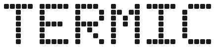
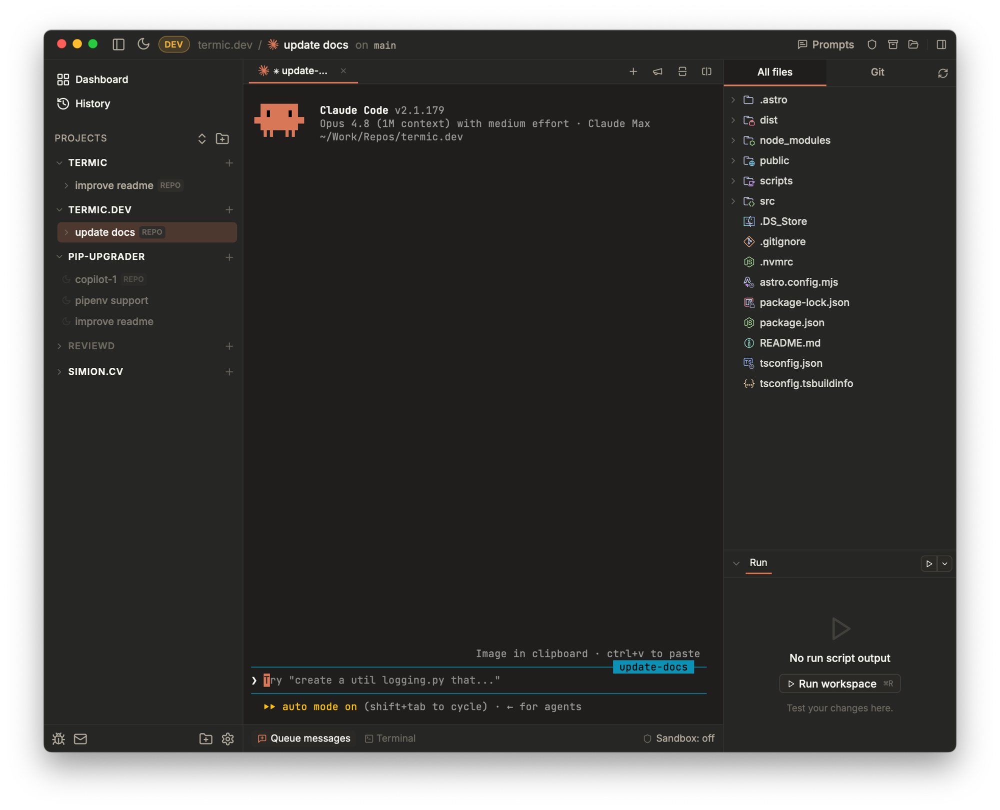

<div align="center">



### Run `claude`, `codex`, `antigravity`, `opencode` and more in parallel. Each in its own git worktree.

**Every new feature the day they ship it: the real CLIs on your own Pro / Max plan, no vendor backend.**

[](https://github.com/simion/termic/releases/latest)
[](./LICENSE)
[](https://github.com/simion/termic/releases/latest)
[](#linux-appimage)
[](#windows-self-build-no-sandbox)
[](https://termic.dev)

[**Install**](#install) · [What it does](#what-it-does) · [Sandbox](#sandbox) · [vs. Conductor](#why-use-termic-over-conductor) · [Contributing](./CONTRIBUTING.md)

<br />



</div>

Termic is a free, open-source desktop app that runs your AI coding-agent CLIs
side by side, each isolated in its own git worktree, with an optional per-task
macOS sandbox cage. It spawns the **real** `claude`, `codex`, `agy` (Antigravity),
`copilot` and `grok` binaries (not the vendor SDKs), so inference rides on the Pro / Max plan you
already pay for. Spin up four agents on the same branch, broadcast one prompt to
all of them, watch a reliable work-done indicator tell you the moment each finishes.

---

## Install

The recommended path is Homebrew + the official tap:

```sh
brew install --cask simion/termic/termic
```

That single command auto-taps `simion/homebrew-termic`, downloads the
latest `.dmg`, and installs `Termic.app` into `/Applications`. Termic is
signed with a Developer ID certificate and notarized by Apple, so there's
no Gatekeeper warning.

Updates: Termic ships with a self-updater. When a new release lands you'll
see an **Update X.Y.Z** pill in the top-right of the toolbar; click it
to download + verify + relaunch. To check manually:

```sh
brew upgrade --cask termic
```

### Direct download

`.dmg`, `.app.tar.gz`, and the ed25519 signature for each version live at
the [Releases](https://github.com/simion/termic/releases) page. The `.dmg`
is signed and notarized by Apple, so it opens on first launch with nothing
else to do.

### Linux (AppImage)

Download `termic_<version>_amd64.AppImage` from the
[Releases](https://github.com/simion/termic/releases) page, make it
executable, and run it:

```sh
chmod +x termic_*_amd64.AppImage
./termic_*_amd64.AppImage
```

The AppImage is ed25519-signed by the same CI flow as the macOS build,
so the in-app updater works the same way: a new release appears as the
**Update X.Y.Z** pill in the top-right, click to download + verify +
relaunch. Keep the AppImage somewhere writable like `~/Applications/`
so the updater can replace it in place.

The Seatbelt sandbox is macOS-only, so on Linux the task's Shield
toggle is disabled. **Docker mode** is the Linux answer: it is not
macOS-gated, so wherever Docker runs you can cage an agent in a
container instead. Everything else (worktrees, parallel tabs,
find-in-files, themes, in-app diff) works the same.

Wayland note: if fonts render thin, force X11 with `GDK_BACKEND=x11`
in front of the launch command (or in the `.desktop` file's `Exec=`).

### Build from source

#### macOS (first-class)

```sh
git clone https://github.com/simion/termic
cd termic
make setup          # brew/rust/node + npm install + cargo check
make install        # build, copy to /Applications, launch
```

`make dev` (vite HMR + Rust auto-rebuild) is the iteration loop — see
[CONTRIBUTING.md](./CONTRIBUTING.md) if you plan to hack on the code.

#### Linux (build it yourself)

The signed AppImage on the
[Releases](https://github.com/simion/termic/releases) page is the
recommended path for most users — see [Linux (AppImage)](#linux-appimage)
above. Build from source if you want to hack on it, ship a `.deb` /
`.rpm` for your own distro packaging, or run an unreleased commit.

Prerequisites — Debian / Ubuntu (24.04+ has WebKitGTK 4.1):

```sh
sudo apt update
sudo apt install -y \
  build-essential curl wget file git pkg-config \
  libwebkit2gtk-4.1-dev libgtk-3-dev libayatana-appindicator3-dev \
  librsvg2-dev libssl-dev libsoup-3.0-dev libxdo-dev

# Rust stable
curl --proto '=https' --tlsv1.2 -sSf https://sh.rustup.rs | sh -s -- -y
. "$HOME/.cargo/env"

# Node 20+ — distro package, nvm, fnm, asdf, or mise (whichever you use)
```

Fedora:

```sh
sudo dnf install -y \
  @development-tools curl wget file git pkgconfig \
  webkit2gtk4.1-devel gtk3-devel libappindicator-gtk3-devel \
  librsvg2-devel openssl-devel libsoup3-devel libxdo-devel
```

Arch:

```sh
sudo pacman -S --needed base-devel curl wget file git pkgconf \
  webkit2gtk-4.1 gtk3 libayatana-appindicator librsvg openssl libsoup3 xdotool
```

Build and install:

```sh
git clone https://github.com/simion/termic
cd termic
npm install
npm run tauri build           # ~5 min first time, faster on incremental
```

The bundles land under `src-tauri/target/release/bundle/`. Pick whichever
fits your distro:

```sh
# Debian / Ubuntu / Pop / Mint
sudo apt install ./src-tauri/target/release/bundle/deb/termic_*_amd64.deb

# Fedora / RHEL / openSUSE
sudo dnf install ./src-tauri/target/release/bundle/rpm/termic-*.x86_64.rpm

# Distro-agnostic — no install needed, just make it executable and run
chmod +x src-tauri/target/release/bundle/appimage/termic_*_amd64.AppImage
./src-tauri/target/release/bundle/appimage/termic_*_amd64.AppImage
```

After the `.deb` / `.rpm` install, "Termic" shows up in your application
launcher. The in-app updater only knows how to replace the AppImage in
place — `.deb` / `.rpm` users upgrade via `git pull && npm run tauri build`
+ reinstall.

If the window looks slightly off — an empty gap on the left of the top
bar, for example — that's the 84px reservation for macOS traffic-light
controls. Harmless, will be cleaned up when the cross-platform chrome
lands.

Wayland note: if fonts render thin, force X11 with
`GDK_BACKEND=x11 termic` (or set it in the `.desktop` file's `Exec=`).

#### Windows (self-build, no sandbox)

Same story: no prebuilt binaries, build works, sandbox is a no-op.
On Windows 11 (or Windows 10 with WebView2 Evergreen installed):

1. Install [Microsoft C++ Build Tools](https://visualstudio.microsoft.com/visual-cpp-build-tools/) (the "Desktop development with C++" workload).
2. Install [Rust stable](https://www.rust-lang.org/tools/install) (rustup).
3. Install [Node 20+](https://nodejs.org/) and [Git for Windows](https://git-scm.com/download/win).

Then in PowerShell:

```powershell
git clone https://github.com/simion/termic
cd termic
npm install
npm run tauri build              # → src-tauri\target\release\bundle\msi\
```

The `.msi` is unsigned — Windows SmartScreen will warn on first run.
Click *More info → Run anyway* (or sign it yourself for distribution).

See [CONTRIBUTING.md](./CONTRIBUTING.md) for the full dev guide.

---

## What it does

Every agent runs inside a real PTY, the same binary you'd launch in iTerm, so
there's nothing between you and the CLI. No vendor SDK (which bills against a
separate credit pool as of [June 2026](https://thenewstack.io/anthropic-agent-sdk-credits/)),
no metered markup, no backend daemon. Here's what the window gives you on top:

- **Parallel worktrees.** Each task is a git worktree under
  `~/termic/tasks/<project>/<name>/`. Run N agents against the same
  branch across tabs; attach to repo root when you don't want a worktree;
  duplicate a worktree to spin up a parallel attempt off the same tip.
- **Command palette (⌘K).** Search and run any action — new task, file
  picker, find-in-files, rename, archive, YOLO, sandbox, theme, sidebars,
  settings — from one place, each with its shortcut inline. ⌘N is a quick
  project picker: fuzzy-find any repo and start a task without touching
  the sidebar.
- **Multi-repo tasks.** Group N repos (backend, frontend, infra) under
  one task with a shared CLAUDE.md and per-member dev-server ports. File
  finder, find-in-files, and the diff view span every member.
- **Broadcast & Brainstorm.** Send a single prompt to every agent in a task concurrently (⇧⌘B). Perfect for multi-agent code reviews, architectural brainstorming, or getting four "second opinions" on a complex bug in seconds.
- **Config as Code (`.termic.yaml`).** Persist all project-specific settings—setup scripts, run commands, preview URLs, and sandbox allowlists—into a `.termic.yaml` file. Commit it to your repo so your whole team gets the same optimized agent environment instantly.
- **Per-task sandbox** (macOS). Filesystem + network cage via
  `sandbox-exec` and an in-process HTTPS CONNECT proxy with a hostname
  allowlist. Lets the agent run with `--dangerously-skip-permissions`
  safely — the cage is the boundary, not the prompt. Or cage it in a
  container instead: **Docker mode** is an alternative isolation backend
  with a stronger filesystem boundary (experimental; network egress is not
  restricted the way the proxy restricts the seatbelt's).
- **Sidebar Cockpit.** Expand any task in the sidebar to see all its active agents, their live work-done indicators, and their agent-managed titles at a glance.
- **Work-done indicator** that's actually reliable. Per-CLI title classifier (Claude spinner, etc.) plus OSC 9;4, gated by byte-quiet and content-hash checks. This reliability enabled **opt-in desktop notifications** that only fire when an agent actually finishes a turn.
- **Message Queues.** Built on top of work-done detection: queue N messages (with optional repeats) to run autonomous "Ralph loop" sessions.
- **Auto-Resume Everything.** Termic auto-resumes sessions even for repo-root tasks, and resumes ALL agent tabs in a task, not just the primary one.
- **Spotlight.** Mirror one worktree's changes — committed, uncommitted, and untracked — into your repo root in real time, so your editor, dev server, and browser see the agent's work live. It runs on a detached HEAD and never commits to your branch; disabling it cleanly restores the checkout. (Conductor checkpoints your branch; Spotlight doesn't touch it.)
- **Find + edit in-app.** ⌘P fuzzy file finder, ⇧⌘F find-in-files (on
  `ripgrep` when you have it, `git grep` otherwise, .gitignore-aware,
  streams live). CodeMirror 6 editor with side-by-side / unified diffs,
  highlighting for ~150 languages, inline git blame, scratchpad tabs that
  survive a relaunch, and **Markdown preview** (including inline
  **Mermaid diagrams**).
- **Code navigation** ([#174](https://github.com/simion/termic/issues/174)).
  ⌘-click or F12 to go to a definition, ⇧F12 for usages, ⌘F12 for a file
  outline, hover for types, double-⇧ to search symbols across the repo.
  Real language servers from your own toolchain (TypeScript, Python, Rust,
  Go, C/C++, Swift, Ruby), one per checkout, nothing running until you switch
  it on for a project and agree to what it costs. Pick a different server per
  language or per project, or point it at a binary of your own. Type checking
  is a separate, experimental switch.
- **Fork-style Git UI.** A dedicated staging area inspired by the Fork app:
  stage, unstage and commit without dropping to a terminal. Plus **History**,
  a full commit graph with lanes, ref chips and message search that git runs
  (so a match ten pages back still comes up first), and **Compare**, every
  path that differs between any ref and your working tree in one tree, with
  mark-as-viewed and inline comments still live.
- **Pull requests.** Open a GitHub PR or GitLab MR from the task you built
  it in, then watch it from the right panel: checks, review state, and
  comments handed to the agent working in that worktree. Or start a task
  FROM an issue, with the composed prompt dropped into the first-message box
  for you to read before anything is sent. Self-hosted GitHub Enterprise and
  GitLab work too, via `gh` / `glab`.
- **Agent races.** Fire one prompt at several agents at once, each in its own
  fresh worktree, then compare their diffs N-up when they finish and adopt
  the winner into your main checkout.
- **Inline review comments.** Leave **GitHub-style inline comments** on the
  diff, or on any file you are just reading — they batch into one message and
  fire to the agent on send. The Review prompt in the prompt library does the
  other direction: hand an agent the diff and let it review you.
- **Prompt library.** Save reusable prompts and fire them at a running or
  fresh agent from the top menu. Ships with Review, Write tests, Security
  review, Explain changes, and Commit; queues automatically if the agent is
  busy.
- **Bring your own agent.** Settings → Agents is an editable registry.
  Drop in aider, ollama, a shell script — 30 seconds. Claude, Codex,
  Antigravity, Copilot, Grok, opencode, pi, and Muse Code ship as
  built-ins.
- **Keyboard-first.** ⌘K command palette, ⌘1..9 swaps tabs, ⌥↑/↓ walks the
  visible sidebar tree, ⌥⌘↑/↓ hops task-only, ⌘D / ⇧⌘D split right /
  bottom, ⌘T spawns a new tab, ⌘W closes one. Every shortcut is rebindable in
  Settings → Shortcuts (⌘/ for the searchable cheat sheet). Seven themes
  (System, Light, Claude, Dark+, Solarized Dark, Cobalt, Matrix), each
  re-themes both chrome and the terminal pane. Or bring your own: drop a
  JSON file in the themes folder and it appears in the picker as a
  first-class theme — see [docs/themes.md](docs/themes.md).
- **Drive it from outside.** The `termic` CLI creates tasks, prompts agents,
  waits for one to go quiet and reads back what it produced, from any shell,
  and an agent inside a task can do the same to fan work out to others. An
  **MCP endpoint** (experimental) exposes the same verbs as tools for clients
  like Claude Desktop. `termic://` links open a pre-filled New Task dialog
  that a human still has to press Create on.
- **Activity.** A process monitor scoped to Termic: every agent, shell and run
  script grouped by project and task, with CPU, memory, output rate and
  uptime, so "which agent is eating my machine" is a glance, not a hunt.
- **Terminal niceties.** xterm.js + WebGL, OSC 52 clipboard (copy out of a
  container or over SSH), optional copy-on-select, inline images, clickable
  links, and drag-and-drop file paths.

---

## Sandbox

Optional per-task macOS Seatbelt (`sandbox-exec`) + an in-process
HTTPS CONNECT proxy per task. Configured per project, pinned per
task at creation (editable later from the task's Shield icon),
enforced from the moment the agent spawns.

The cage:

- **Writes restricted** to the worktree, agent config dirs (`~/.claude`,
  `~/.codex`), package caches (`~/.npm`, `~/.cache`,
  `~/.cargo/registry`), and TMPDIR. Always-denied: `~/.ssh`, `~/.aws`,
  `~/.gnupg`, `~/.netrc`, `~/.docker/config.json`, `~/.kube`, Keychains.
- **Network restricted** via an in-process CONNECT proxy with a regex
  hostname allowlist. Per-CLI vendor APIs (anthropic / google / openai)
  + GitHub + npmjs + PyPI + crates.io baked in. Add custom hosts per
  project. No external daemon — the proxy lives inside the Tauri
  binary, so there's nothing extra to install.
- **YOLO auto-on inside the cage.** The seatbelt profile IS the security
  boundary, so the agent's own permission prompts are skipped. The toolbar
  lightning icon turns red when YOLO is on *without* a sandbox (intentional
  danger signal — agents can `rm -rf $HOME` at that point).

**Docker mode** is the alternative backend: the agent runs inside a
container rather than a seatbelt profile, for a stronger filesystem
boundary and a blast radius that ends at the container. One generic image,
editable as a plain Dockerfile in Settings, built by an explicit action;
each agent's config folder is mounted separately so logins survive and
cloning an agent keeps a work login apart from a personal one. Containers
run as your host user, drop every Linux capability, and cap PID
exhaustion. Marked experimental: network egress is not yet restricted the
way the proxy restricts the seatbelt's.

For the full sandbox design — including the recent-denies debug panel
and the auto-restart-on-edit flow — see [CLAUDE.md](./CLAUDE.md)
§"Sandbox".

---

## Status

- **macOS:** first-class — universal binary (Apple Silicon + Intel),
  signed updater, Homebrew cask. Requires macOS 12+ (Monterey).
- **Linux:** x86_64 AppImage shipped per release, signed by the same
  ed25519 key as the macOS build so the in-app updater works. ARM
  Linux + a Flathub submission are on the roadmap.
- **Windows:** build-from-source works today (Tauri 2 + WebView2). No
  prebuilt binaries yet — CI matrix entry is on the roadmap.
- **Sandbox:** the Seatbelt cage is macOS-only (`sandbox-exec` is
  Apple's frontend to it), so the Shield toggle is disabled on Linux
  and Windows. **Docker mode** is not macOS-gated, so a container cage
  is available wherever Docker runs.

---

## Why use Termic over Conductor

The honest pitch — see [termic.dev/vs/conductor](https://termic.dev/vs/conductor/) for the full version with explanations.

| | Termic | Conductor |
|---|---|---|
| License | Open source (AGPL-3.0) | Closed source, proprietary |
| Price | Free | Paid |
| Parallel agents in git worktrees | ✓ | ✓ |
| Attach an agent to the repo root (no worktree) | ✓ | ✗ (always a worktree) |
| Runs `claude` | ✓ | ✓ |
| Runs `codex` | ✓ | ✓ |
| Bring your own agent (PTY-based) | ✓ — opencode, aider, ollama, anything that runs in a terminal | ✗ |
| Multi-repo tasks | ✓ — N repos under one wrapper, shared CLAUDE.md, per-member ports | ✗ |
| Sync a worktree into the repo root live | ✓ — Spotlight, detached HEAD, never commits to your branch | ◐ Checkpoints onto your branch |
| Command palette + fuzzy project / file switch | ✓ — ⌘K / ⌘N / ⌘P | varies |
| Uses Claude Pro / Max subscription quota | ✓ — spawns the interactive `claude` CLI directly | ◐ Routes through the Claude Agent SDK |
| Monthly Claude cost on top of your Pro / Max plan | $0 — same quota as running `claude` in iTerm | Capped by the separate SDK credit ($20 / $100 / $200) |
| Local-only, no vendor backend in the loop | ✓ | ✗ — vendor-hosted services |
| Per-task macOS sandbox (filesystem + network) | ✓ — Seatbelt + in-process network allowlist | ✗ |
| Work-done indicator from real PTY signals | ✓ — OSC 9;4 + per-CLI title classifier, no idle guessing | ✗ |
| Side-by-side ⇄ unified diff with syntax highlighting | ✓ | varies |
| Platforms | macOS + Linux today (signed AppImage); Windows on the way | macOS |

If you already pay for a Claude Pro / Max plan, Termic spawns the same
`claude` binary that plan covers — no separate metered usage, no
per-token markup. The agent and Anthropic still see the same auth they'd
see in iTerm.

---

## Roadmap

Two lists, and the difference between them is a commitment.

**Planned** is what will be built. Each one has an issue labelled
[`planned`](https://github.com/simion/termic/issues?q=is%3Aissue+label%3Aplanned),
and that issue is where its progress lives.

**Ideas** are not committed to. Most have a write-up under
[`docs/ideas/`](docs/ideas/) arguing the case, and several are detailed
enough to build from, but none of them is decided. They deliberately have
no tracking issue: an issue implies someone intends to do it. Open one, or
comment on the discussion linked below, if you want to make the case or
pick something up.

Approved ideas move to [`docs/plans/`](docs/plans/) as implementation-ready
specs and get an issue at the same time. That is the whole promotion path:
`docs/ideas/` → `docs/plans/` + a `planned` issue → built.

### Planned

- **Mobile app.** ([#165](https://github.com/simion/termic/issues/165)) A
  companion app for checking on and steering tasks while away from the Mac.
- **MCP server endpoint, phases B1 and B2.** A scoped control plane an agent
  can call without being handed a terminal. Phase A (the stateless endpoint,
  the settings surface, one-click client setup) shipped in 1.0.0; the per-task
  bearer token that answers which task is calling and what it may do is what is
  left, and the 2026-07-28 spec revision reopened enough of the design that it
  is an idea again rather than a plan.
  [docs/ideas/mcp.md](docs/ideas/mcp.md).
- **Intentional agent-driven orchestration.** The plumbing already ships:
  an agent can spawn a task with `--wait`, prompt another, read its result
  and branch on the exit code. What is missing is intent, and an opinion
  about shape (fan out, queue behind, supervisor and workers).
  [docs/ideas/agent-orchestration.md](docs/ideas/agent-orchestration.md).
- **Windows support, then Windows prebuilts.** Linux AppImage CI is live;
  the Windows MSI is the matching matrix entry, and it depends on the app
  compiling on Windows at all. The audit in
  [docs/ideas/windows.md](docs/ideas/windows.md) is a prediction: nothing in
  it has been built on Windows yet.
- **Profiles.** A fully isolated instance with its own window, projects,
  tasks and settings, so work and personal stay in separate windows on
  separate monitors. [docs/plans/profiles.md](docs/plans/profiles.md).
- **Several accounts per agent.** Add both subscriptions once, pick which
  one a profile uses, and switch a running task to the other when the first
  one hits its limit, without losing the conversation.
  [docs/plans/agent-credentials.md](docs/plans/agent-credentials.md).
- **Ambient agent status.** A Dock tile, or a strip beside the Dock, showing
  what every agent is doing without bringing the window forward.
  [docs/ideas/dock-widget.md](docs/ideas/dock-widget.md).
- **Import Warp and Ghostty themes.** Termic has a native JSON theme format,
  but two large theme ecosystems already exist and neither is ours. Scan
  both directories, translate, and let people pick from the library they
  already collected.
- **Linear integration.** GitHub and GitLab already ship: start a task from
  an issue, open the PR from the app, watch its checks and reviews from the
  right panel. Linear is the same shape and is not built.
- **Wider Linux reach.** ARM Linux builds and a Flathub submission. The
  Status section above already promises both.
- **Opt-in usage telemetry.** Anonymous, off by default, one toggle: which
  features are used and how often, plus crash reports. No code, no prompts,
  no file paths, no agent output, no project names.
- **Termic in the official Homebrew cask repository.** Today the install
  path is this repo's own tap, so it takes a `brew tap` first. Upstream
  would make it plain `brew install --cask termic`. The cask is ready (the
  `.dmg` is signed and notarized, and its `livecheck` makes it
  autobump-eligible), and
  [Homebrew/homebrew-cask#274896](https://github.com/Homebrew/homebrew-cask/pull/274896)
  is filed and closed on one thing only: notability. Homebrew asks for 90
  forks, 90 watchers or 225 stars when the author submits their own
  software. The forks already clear the third-party bar, so
  [stars](https://github.com/simion/termic/stargazers) are the realistic
  lane, and at 225 the same PR gets reopened.


---

## Sponsors

Termic is free, AGPL-3.0, and built by its author and a growing group of dedicated open-source contributors. If your team builds on AI coding agents and finds it useful, sponsoring helps keep it moving.

| [](https://www.dontpayfull.com) |
|---|

Also sponsoring: [Vyttle](https://vyttle.com), [Sage Haven](https://sagehaven.ai).

[](https://github.com/sponsors/simion)

---

## License

[AGPL-3.0-or-later](./LICENSE). Fork it, modify it, build a derivative —
the only string is that derivatives stay AGPL too. The "open core that
quietly went proprietary" pattern can't happen with this license, which
is most of the point.

---

## Links

- **Website:** [termic.dev](https://termic.dev)
- **Issues:** [github.com/simion/termic/issues](https://github.com/simion/termic/issues)
- **Releases:** [github.com/simion/termic/releases](https://github.com/simion/termic/releases)
- **Homebrew tap:** [github.com/simion/homebrew-termic](https://github.com/simion/homebrew-termic)
- **Contributing:** [CONTRIBUTING.md](./CONTRIBUTING.md)
- **Architecture notes (for hackers + AI agents working in this repo):** [CLAUDE.md](./CLAUDE.md)
