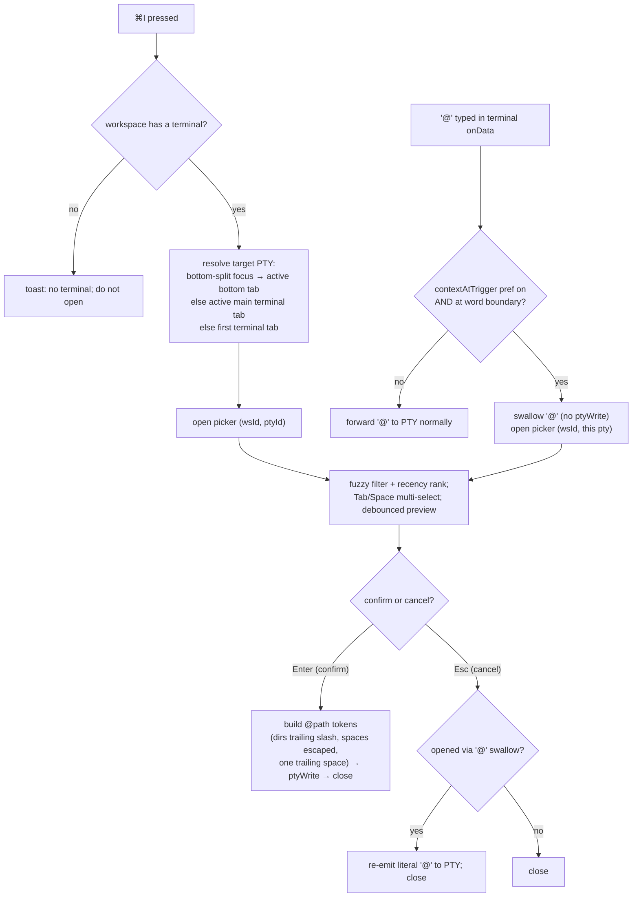

# feat: Advanced context picker for inserting @path tokens into agent terminals

## Summary

Add a two-pane fuzzy picker that inserts workspace-relative `@path` tokens into
the active agent terminal's PTY. Multi-select, recency-ranked, folder-aware,
with a live preview pane. Opened by a new `⌘I` shortcut (always) and, behind an
opt-in preference, by typing `@` at a word boundary inside a terminal.

---

## Problem Frame

Handing files to an agent CLI (claude / codex / gemini) today means typing
paths by hand or dragging files in one at a time. The existing `⌘P`
`FileFinderDialog` is the closest primitive, but it is single-select, has no
preview, no recency bias, and its action is "open an editor tab" — not "insert
context into the conversation the user is having with an agent."

This plan builds the advanced sibling: a picker tuned for the agent-context
workflow. The insertion mechanism is the same channel keystrokes already use
(`ipc.ptyWrite`), so inserted text is indistinguishable from typing. The work
is almost entirely additive — the one change to existing behavior is extracting
the fuzzy matcher out of `FileFinderDialog` into a shared module, which must
preserve `⌘P` behavior exactly.

---

## Requirements

### Picker behavior

- R1. `⌘I` in a workspace that has at least one terminal opens the context picker over the active terminal. With no terminal in the workspace, it shows a toast ("No terminal to insert into") and does not open.
- R2. Typing in the search field filters the file list with the same fuzzy matcher `⌘P` uses (substring-first, multi-term AND).
- R3. With an empty query, results are ordered by recency (recently modified and git-changed files first).
- R4. The list supports multi-select: `Tab` or `Space` toggles the highlighted row; selected files render a check and appear as removable chips. `↑`/`↓` navigate, highlight follows the mouse.
- R5. `Enter` confirms — inserting all selected files, or the single highlighted row when nothing is checked. `Esc` cancels.
- R6. Directories are selectable and insert with a trailing slash (`@path/`).
- R7. A preview pane shows the highlighted file's content (text), flags binaries, and lists children for a highlighted folder.

### Insertion

- R8. Confirming writes `@<relative-path>` tokens to the resolved terminal's PTY: space-separated, one trailing space, directories with a trailing slash, spaces in paths backslash-escaped. The picker then closes.

### Triggers

- R9. The `⌘I` trigger always works regardless of the `@`-interception preference.
- R10. A preference `contextAtTrigger` (default off) gates `@`-interception. When on, typing `@` at a word boundary in a terminal opens the picker and swallows the `@`; cancelling re-emits the literal `@`; confirming inserts tokens with no duplicated `@`. When off, `@` types normally.

### Non-regression

- R11. `⌘P` `FileFinderDialog` behaves exactly as before — same fuzzy ranking, same highlighting, same open-tab action.

---

## Key Technical Decisions

- New component, shared matcher: A standalone `ContextPickerDialog` owns multi-select / preview / recency / insertion; the fuzzy matcher moves to `src/lib/fuzzy.ts` and is imported by both pickers. Keeps the clean `FileFinderDialog` untouched in behavior while avoiding a second copy of the scoring logic. (see origin: docs/superpowers/specs/2026-05-28-context-picker-design.md)
- Recency data via a new Tauri command, not the existing finder command: `workspace_list_files_for_finder` returns a flat `Vec<String>` with no mtime and no directories. Rather than overload it (and perturb `⌘P`), add `workspace_context_files` that runs the same `git ls-files --cached --others --exclude-standard`, adds a per-path modified-time, and synthesizes directory entries from path prefixes. Ignore rules stay identical because both issue the same git call.
- Git-changed boost reuses `workspace_changes`: the changed-file set comes from flattening the existing `workspace_changes` groups' file paths, so no new git plumbing is needed for the "what I'm working on" boost.
- Insertion target resolved from tab state, not a DOM registry: terminal tabs already carry `ptyId`. The target PTY is resolved with the same focus rule `⌘W`/`⌘T`/`⌘K` use (bottom-split focus → active bottom tab; else active main terminal tab; else first terminal tab; else none). The drag-drop host→pty registry does not exist on this branch, so we do not depend on it.
- `@`-interception is a layer inside `term.onData`, not a new global listener: the keystroke is swallowed before `ipc.ptyWrite`; cancel re-emits it. Word-boundary detection is a heuristic read of `term.buffer.active` (the agent TUI owns the real cursor), which is acceptable because the layer is opt-in and `⌘I` is the always-available reliable path.
- TS test harness: the frontend currently has no test runner (no Vitest/Jest, no `*.test.*`); the repo verifies frontend work manually/empirically. Recommendation: pull all decision logic (fuzzy match, ranking blend, insertion formatter, target resolution, word-boundary check) into pure exported functions and add Vitest (Vite-native, dev-only) covering just those modules; verify UI and wiring manually in-app per repo convention. If introducing a runner is unwanted, the same enumerated scenarios become a manual checklist and the pure functions still isolate the risk. The new Rust command is tested with the existing inline `#[cfg(test)]` pattern in `src-tauri/src/lib.rs` (`cargo test` already runs).
- Refetch-on-open, no cache: mirrors `FileFinderDialog`'s deliberate "fresh listing each open, no invalidation story" trade-off. Preview reads are debounced and cancellable so arrow-key nav on a large repo never blocks on file IO.

---

## High-Level Technical Design

The picker has two open paths that converge on one confirm/cancel lifecycle.
The branching that prose alone leaves ambiguous is the `@`-swallow/cancel logic
and the target-PTY resolution, so they are drawn explicitly. This diagram is
authoritative for the control flow.

Ranking data flow (open → render): fetch `workspace_context_files` (paths +
mtime + is_dir) and `workspace_changes` (changed-path set) in parallel; for each
file compute `fuzzyScore(path, query)` plus a recency boost (mtime half-life,
~14 days) plus a flat boost when the path is in the changed set; empty query
sorts by recency alone; cap rendered rows at `MAX_RESULTS`.

---

## Implementation Units

Phase 1 (U1–U6) is a complete, usable feature on its own. Phase 2 (U7–U8) layers
the opt-in `@` trigger on top without touching the Phase 1 confirm path.

### U1. Extract shared fuzzy matcher

**Goal:** Move the fuzzy-match logic out of `FileFinderDialog` into a shared module so the context picker reuses one matcher.

**Requirements:** R2, R11

**Dependencies:** none

**Files:**
- create `src/lib/fuzzy.ts`
- modify `src/components/dialogs/FileFinderDialog.tsx`
- create `src/lib/fuzzy.test.ts` (Vitest; see test-harness KTD)

**Approach:** Move `matchTerm`, `fuzzyScore`, and the `Scored` interface verbatim into `src/lib/fuzzy.ts` and export them. `FileFinderDialog` imports them and deletes its inline copies. No scoring change — this is a pure relocation. The `Highlighted` component and `MAX_RESULTS` stay in `FileFinderDialog` (or `MAX_RESULTS` moves to `fuzzy.ts` if the context picker wants to share the cap; either is fine — pick one home and import).

**Patterns to follow:** the existing functions in `src/components/dialogs/FileFinderDialog.tsx`.

**Test scenarios:**
- Substring match beats scattered subsequence (e.g. query `review` highlights contiguous `Review`, not greedy r-e-v-i-e-w).
- Multi-term query is AND-ed: `components broa` matches a path containing both terms; missing either term returns null.
- Word-boundary / basename bonuses applied (match after `/`, `-`, `_`, `.` scores higher; basename match beats dir match).
- Empty query returns a zero-score match (not null).
- Characterization: a fixed sample list ranks in the same order before and after extraction.

**Verification:** `⌘P` still fuzzy-finds and highlights identically in-app; pure-function scenarios pass.

### U2. `workspace_context_files` Rust command + IPC wrapper

**Goal:** Provide a file list enriched with modification time and directory entries for recency ranking and folder selection.

**Requirements:** R3, R6

**Dependencies:** none

**Files:**
- modify `src-tauri/src/lib.rs` (new `async fn workspace_context_files`, `ContextFile` struct, register in the `invoke_handler!`, `#[cfg(test)]` unit test for the dir-synthesis helper)
- modify `src/lib/ipc.ts` (`workspaceContextFiles` wrapper + `ContextFile` interface)
- modify `src/lib/types.ts` if the shared type lives there instead of `ipc.ts`

**Approach:** `async fn` + `tauri::async_runtime::spawn_blocking` (per the long-running-IPC rule). Run the same `git ls-files --cached --others --exclude-standard` the finder uses. For each returned file, `fs::metadata(...).modified()` → epoch milliseconds (`mtime_ms: i64`; on stat failure default to 0). Synthesize directory entries: collect the set of unique ancestor directory prefixes across all file paths; emit each as a `ContextFile { is_dir: true }` with `mtime_ms` = max child mtime (or 0). Return `Vec<ContextFile { path, mtime_ms, is_dir }>`. Keep the dir-synthesis as a small pure helper so it is unit-testable without a real repo.

**Patterns to follow:** `workspace_list_files_for_finder` (the git call + spawn_blocking shape) and the inline `#[cfg(test)]` tests near `src-tauri/src/lib.rs:4539`.

**Test scenarios:** (Rust `cargo test`, on the pure dir-synthesis helper)
- A flat file list with no nesting yields zero synthesized directories.
- `a/b/c.ts` plus `a/d.ts` yields directories `a` and `a/b` exactly once each (no duplicates).
- Directory `mtime_ms` equals the max of its descendant files' mtimes.
- Empty file list yields an empty result.
- Note: ignore-rule correctness is delegated to `git ls-files` (integration-level, verified in-app), not unit-tested here.

**Verification:** command returns files + dirs + mtimes for a real workspace; `cargo test` passes for the synthesis helper.

### U3. Context-picker UI store state

**Goal:** Hold the picker's open state and its insertion target without churning the workspace tree.

**Requirements:** R1, R8

**Dependencies:** none

**Files:**
- modify `src/store/ui.ts`

**Approach:** Add `contextPicker: { wsId: string; ptyId: string } | null` to `UIState`, plus `openContextPicker(wsId, ptyId)` and `closeContextPicker()`, mirroring the `fileFinderWsId` / `openFileFinder` / `closeFileFinder` triple. Keeps the target PTY alongside the open flag so the dialog knows where to write on confirm.

**Patterns to follow:** the `fileFinderWsId` state + actions in `src/store/ui.ts`.

**Test expectation:** none — trivial store wiring; exercised through U5 behavior.

**Verification:** dialog opens/closes off this state; no workspace-tree re-render churn when toggled.

### U4. Ranking and insertion-string helpers

**Goal:** Pure functions for recency-blended ranking and `@path` insertion-string construction.

**Requirements:** R3, R6, R8

**Dependencies:** U1 (uses `fuzzyScore`), U2 (consumes `ContextFile`)

**Files:**
- create `src/lib/contextPicker.ts`
- create `src/lib/contextPicker.test.ts` (Vitest)

**Approach:** `rankContextFiles(files, changedSet, query, nowMs)` → scored/sorted rows: combine `fuzzyScore` with a recency boost (mtime half-life ~14 days, normalized) weighted at roughly a quarter of the match magnitude, plus a flat boost when the path is in `changedSet`; empty query short-circuits to a recency (then changed) sort. `buildInsertion(selected)` where each entry knows its path + is_dir → joins `@<path>` tokens space-separated with one trailing space, appends `/` to directory tokens, backslash-escapes spaces in paths. `nowMs` is passed in (not read from a clock inside) so the function is deterministic in tests.

**Patterns to follow:** pi-agent reference recency model (14-day half-life) noted in the origin doc; the backslash-escape convention from the app's drag-drop behavior described in the origin doc.

**Test scenarios:**
- Recency: with equal fuzzy scores, the more recently modified file ranks higher; a file modified ~14 days ago gets roughly half the boost of a just-modified file.
- Git-changed boost: a changed file outranks an equal-fuzzy unchanged file.
- Match dominance: a strong exact-name match outranks a stale file with a weaker fuzzy match.
- Empty query: results are ordered newest-first (changed files ahead of equal-mtime unchanged).
- Insertion single file: `@src/a.ts ` (trailing space).
- Insertion multiple: `@src/a.ts @src/b.ts ` (space-joined, one trailing space).
- Insertion directory: `@src/components/ ` (trailing slash).
- Insertion path with space: `@my\ file.ts ` (escaped).
- Empty selection: empty string.

**Verification:** pure-function scenarios pass; ranking "feels right" in-app (recent/changed surface first).

### U5. ContextPickerDialog component

**Goal:** The two-pane picker UI: search + multi-select list + chips + live preview, inserting on confirm.

**Requirements:** R1, R2, R3, R4, R5, R6, R7, R8

**Dependencies:** U1, U2, U3, U4

**Files:**
- create `src/components/dialogs/ContextPickerDialog.tsx`
- modify `src/components/dialogs/Dialogs.tsx` (mount `<ContextPickerDialog />`)

**Approach:** Radix dialog, top-anchored like `FileFinderDialog` (`fixed top-12`), wider for two panes (`w-[min(880px,92vw)]`), flexbox-centered with no transform on `Dialog.Content` (sub-pixel rule). On open (keyed off `useUI(s => s.contextPicker)`), fetch `workspaceContextFiles` and `workspaceChanges` in parallel; build the changed-path set; rank via U4. Left pane: search input (`spellCheck=false`, `autoCorrect/Capitalize/Complete=off`), a chips row for the current selection (click chip to remove), and a `MAX_RESULTS`-capped results list with file icons (`fileIconUrl`), check marks on selected rows, mouse-follow highlight. Right pane: preview of the highlighted entry — debounced (~120ms) `workspaceFileRead`, cancellable (ignore late results for a path no longer highlighted), client-side truncate (~200 lines / ~10KB), null-byte → "Binary file", strip ANSI/control chars; for a highlighted directory show a short child listing instead. Keyboard: `↑/↓` move, `Tab`/`Space` toggle selection, `Enter` confirm (`buildInsertion` → `ipc.ptyWrite(contextPicker.ptyId, encodedBytes)` → `closeContextPicker`), `Esc` cancel. Round any pixel dimensions.

**Patterns to follow:** `src/components/dialogs/FileFinderDialog.tsx` (dialog shell, list, keyboard nav, icons), `src/components/dialogs/FindInFilesDialog.tsx` (preview rendering, cancellable streaming/late-result guard), `src/lib/ipc.ts#ptyWrite` (`Array.from(new TextEncoder().encode(str))`).

**Test scenarios:** (UI — manual/in-app per repo convention; pure pieces delegated to U4)
- Open with empty query shows recent/changed files first.
- Typing filters; highlighting matched characters mirrors `⌘P`.
- `Tab`/`Space` adds a chip; clicking a chip removes it; `Enter` with checked files inserts all; `Enter` with none checked inserts the highlighted row.
- Highlighting a text file shows a preview; a binary shows "Binary file"; a folder shows a child listing.
- Confirm writes the expected `@path` string into the focused terminal and closes.
- Large repo (thousands of files): typing and arrow-nav stay responsive; preview never blocks nav.
- `Esc` closes without inserting.

**Verification:** end-to-end in-app insertion into a live agent terminal; no terminal flicker or nav jank on a large repo.

### U6. `⌘I` shortcut + target-PTY resolution

**Goal:** Open the picker over the correct terminal from a global shortcut.

**Requirements:** R1, R9

**Dependencies:** U3, U5

**Files:**
- modify `src/hooks/useShortcuts.ts`
- create `src/lib/activeTerminal.ts` (pure resolver) + `src/lib/activeTerminal.test.ts` (Vitest)

**Approach:** Add an `⌘I` (`i`, no shift) branch in `useShortcuts.ts`, scoped to an active workspace, no `isTyping` guard (xterm hidden-textarea rationale, same as `⌘P`), always `preventDefault`. Factor the target resolution into a pure `resolveTargetPty(state, wsId, bottomFocused)` helper that returns a `ptyId` or null using the precedence: bottom-split focused → active bottom tab's `ptyId`; else active main tab if it is a terminal → its `ptyId`; else first terminal tab in the workspace → its `ptyId`; else null. The handler passes `document.activeElement.closest("[data-bottom-split]")` as `bottomFocused`. Null → `pushToast("No terminal to insert into")`; otherwise `openContextPicker(wsId, ptyId)`.

**Patterns to follow:** the `⌘P` handler and the `[data-bottom-split]` focus checks for `⌘W`/`⌘T`/`⌘K` in `src/hooks/useShortcuts.ts`; `pushToast` in `src/store/ui.ts`.

**Test scenarios:** (`resolveTargetPty`, pure)
- Bottom-split focused with an active bottom tab → that bottom tab's pty.
- Main terminal tab active (no bottom focus) → that tab's pty.
- Active main tab is an editor but a terminal tab exists → first terminal tab's pty.
- No terminal tabs in the workspace → null.
- Terminal tab present but with no `ptyId` yet (not spawned) → skipped / null as appropriate.

**Verification:** `⌘I` from a focused agent terminal opens the picker targeting it; from the editor it still opens targeting a terminal; in a terminal-less workspace it toasts.

### U7. `contextAtTrigger` preference + Settings toggle

**Goal:** Persisted, default-off preference gating the `@` trigger, exposed in Settings.

**Requirements:** R10

**Dependencies:** none

**Files:**
- modify `src/store/prefs.ts`
- modify `src/components/settings/GeneralSection.tsx`

**Approach:** Add `contextAtTrigger: boolean` to `PrefsState` with localStorage key `contextAtTrigger`, default `false`, plus `setContextAtTrigger` following the `desktopNotifications` setter shape (localStorage write + `set`). Add a `<Toggle>` in `GeneralSection` ("Open the context picker when you type @ in a terminal") in a bordered section like the existing toggles.

**Patterns to follow:** `desktopNotifications` / `settledHighlight` prefs in `src/store/prefs.ts` and the local `Toggle` component in `src/components/settings/GeneralSection.tsx`.

**Test expectation:** none — pref plumbing; verify the toggle persists across relaunch in-app.

**Verification:** toggling persists; `usePrefs.getState().contextAtTrigger` reflects it.

### U8. `@`-key interception in TerminalPane

**Goal:** When enabled, typing `@` at a word boundary opens the picker and swallows the `@`; cancel re-emits it.

**Requirements:** R10

**Dependencies:** U3, U5, U7

**Files:**
- modify `src/components/workspace/TerminalPane.tsx`
- create `src/lib/atTrigger.ts` (pure word-boundary check) + `src/lib/atTrigger.test.ts` (Vitest)

**Approach:** Inside the existing `term.onData` callback (around `src/components/workspace/TerminalPane.tsx:830`), before the `ipc.ptyWrite`: if `data === "@"` and `usePrefs.getState().contextAtTrigger` and `isAtWordBoundary(term)` — swallow (return without writing) and `openContextPicker(ws.id, ptyId)`. Factor the boundary check into a pure `isAtWordBoundary(buffer-ish)` helper reading `term.buffer.active`: boundary when cursor is at column 0 or the cell immediately before the cursor is whitespace/empty. Cancel re-emit: `closeContextPicker` cannot tell why it closed, so track open-origin — when the picker was opened via `@`-swallow and closes without insertion, write the literal `@` back to that pty. (Store the origin on the `contextPicker` state set in U3, e.g. an `atOrigin?: boolean`, or have the dialog's cancel path re-emit when an origin flag is present.)

**Patterns to follow:** the `term.onData` encode→`ipc.ptyWrite` path already in `src/components/workspace/TerminalPane.tsx`.

**Technical design (directional, not implementation spec):** the cancel re-emit is the one piece of state to thread — closing the picker needs to know whether to put the `@` back. Simplest shape: `openContextPicker(wsId, ptyId, atOrigin)` records `atOrigin`; the dialog's cancel handler, when `atOrigin` is set and no insertion happened, calls `ptyWrite(ptyId, ["@"])` before closing. Confirm never re-emits (the `@` is already the first char of the inserted token).

**Test scenarios:**
- `isAtWordBoundary`: cursor at column 0 → true.
- `isAtWordBoundary`: previous cell is a space/empty → true.
- `isAtWordBoundary`: previous cell is a non-space char → false.
- (manual/in-app) Pref off: `@` types into the terminal normally, picker does not open.
- (manual/in-app) Pref on, boundary: `@` opens the picker and does not appear in the terminal.
- (manual/in-app) Pref on, cancel: the literal `@` appears after Esc.
- (manual/in-app) Pref on, confirm: inserted tokens start with a single `@` (no doubled `@`).
- (manual/in-app) Pref on, mid-word (`foo@`): `@` types normally, picker does not open.

**Verification:** all four enabled/disabled × confirm/cancel paths behave per R10 in a live terminal; the boundary helper's scenarios pass.

---

## Scope Boundaries

In scope: the picker, its two triggers, recency + git-changed ranking, folder
selection, live preview, the new Rust command, and the opt-in preference. Both
phases ship in this plan.

### Deferred to Follow-Up Work

- Cross-project / global file search (the pi-agent reference's `Ctrl+G`). The picker is workspace-scoped.
- A byte-capped Rust preview-read command. v1 reuses `workspace_file_read` with client-side truncation; revisit only if huge files slip past the `git ls-files` filter and cause preview jank.
- Caching the file list across opens. Refetch-on-open is the deliberate choice, matching `⌘P`.

### Non-goals

- Inserting context into the CodeMirror editor. Context is an agent-terminal concept; the editor is not an insertion target.
- A bespoke `@`-token escaping scheme per agent CLI. Backslash-escaping spaces is best-effort parity with Terminal.app; agent `@`-parsers vary and full per-agent quoting is out of scope (see Risks).

---

## Risks & Dependencies

- `@`-parser variance: agents differ in how they parse `@path` tokens, especially paths containing spaces. Backslash-escaping is best-effort; a path with spaces may not resolve in every agent. Mitigation: spaces in repo paths are rare; document the limitation; `⌘I` users see exactly what was inserted.
- Word-boundary heuristic fragility: `term.buffer.active` reflects the rendered TUI, which the agent controls, so the boundary check can misfire in unusual prompts. Mitigation: the `@` layer is opt-in (default off) and `⌘I` is the always-correct fallback.
- Preview IO on large files: a file that passes the `git ls-files` filter but is very large could make `workspace_file_read` expensive. Mitigation: debounced + cancellable preview; client truncation; deferred byte-capped command if it bites.
- Extraction regression (U1): moving the matcher risks subtly changing `⌘P`. Mitigation: characterization test pins ranking order; in-app `⌘P` check.
- No existing frontend test harness: the pure-logic test scenarios assume Vitest is added (see KTD). If not added, they convert to a manual checklist. Either way the logic is isolated in pure modules.

---

## Sources / Research

- Origin design spec: `docs/superpowers/specs/2026-05-28-context-picker-design.md` (approved; full behavioral spec and the pi-agent reference model).
- `src/components/dialogs/FileFinderDialog.tsx` — fuzzy matcher to extract; dialog shell, keyboard nav, icon resolution to mirror.
- `src/components/dialogs/FindInFilesDialog.tsx` — cancellable late-result guard and preview rendering pattern.
- `src-tauri/src/lib.rs` — `workspace_list_files_for_finder` (`git ls-files` shape), `workspace_changes` (changed-set source), inline `#[cfg(test)]` tests (~line 4539) to mirror.
- `src/lib/ipc.ts` — `ptyWrite`, `workspaceFileRead`, `workspaceChanges` wrappers and the camelCase/snake_case convention for adding `workspaceContextFiles`.
- `src/hooks/useShortcuts.ts` — `⌘P` handler and `[data-bottom-split]` focus checks to mirror for `⌘I` and target resolution.
- `src/store/prefs.ts` / `src/components/settings/GeneralSection.tsx` — boolean-pref + `Toggle` patterns.
